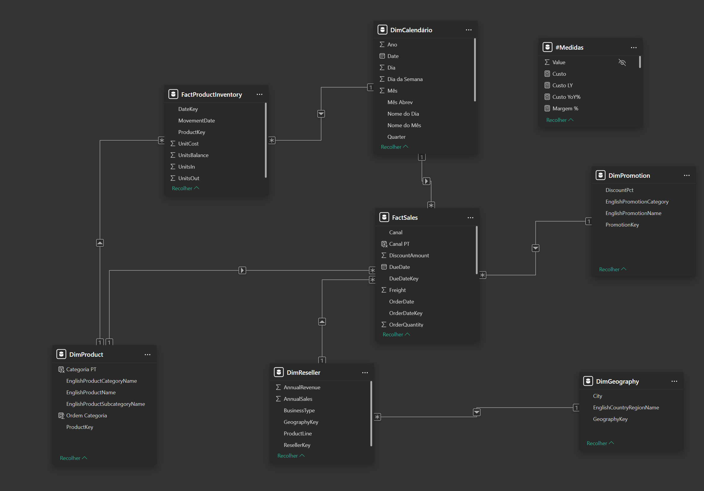

# Adventure Works — Canal de Venda como Determinante da Rentabilidade

**Em que medida o canal de venda determina a rentabilidade do negócio?**

Análise estratégica comparando os canais Internet e Revendedores da Adventure Works, empresa do segmento de ciclismo, entre 2011 e 2013. O Adventure Works é um dataset público da Microsoft, utilizado aqui como base para um projeto de análise em Power BI. Os dados cobrem vendas por produto, categoria, canal e região, a partir das quais foram calculadas as métricas de receita, custo, margem e variação.

---

## Modelagem de Dados

O modelo segue um esquema estrela com a tabela fato **FactSales**, que unifica as vendas de Internet e Revendedores e já carrega a coluna `Canal`, dispensando a junção de duas tabelas fato separadas.

Embora o arquivo contenha dimensões adicionais (DimGeography, DimReseller, DimPromotion) e a fato de estoque (FactProductInventory), a análise se apoiou em três tabelas: **FactSales**, **DimProduct** (hierarquia de categoria e subcategoria) e **DimCalendário**.



As transformações na base se restringiram a duas colunas calculadas em DimProduct e uma em FactSales:

- `Canal PT` em FactSales: tradução do valor "Reseller" para "Revendedores", aplicada de forma consistente em todo o relatório
- `Categoria PT` e `Ordem Categoria` em DimProduct: tradução e ordenação das categorias

Todo o restante da análise foi construído com medidas DAX.

---

## Medidas DAX

As medidas base cobrem Receita, Custo, Margem Bruta, Margem percentual, Ticket Médio e Quantidade Vendida, cada uma acompanhada de versões de ano anterior (LY) e variação ano a ano (YoY).

---

## Principais Achados

À primeira vista, o negócio aparentava crescimento saudável: a receita dobrou entre 2011 e 2013, o volume quintuplicou e a margem percentual manteve-se estável em torno de 11%. O ticket médio, porém, colapsou 61%, caindo de 821 para 319. O crescimento era sustentado por volume, não por valor.

A origem do problema estava no canal de venda. O canal Revendedores concentrava 73% da receita, mas operava com margem percentual de 1%. O canal Internet, responsável por apenas 27% da receita, sustentava 96% da margem bruta da empresa, com margem percentual de 41%.

A razão dessa discrepância estava na categoria de Bikes, responsável por 82% da receita total. Em Revendedores, a categoria operava com margem percentual de -2%, gerando um prejuízo de 1 milhão no período. As demais categorias tinham margem positiva, mas apenas o suficiente para cobrir esse prejuízo, deixando o canal que sustentava a receita com margem bruta quase nula.

O aprofundamento nas subcategorias revelou Touring Bikes como protagonista da deterioração. Introduzida em 2012, tornou-se em 2013 a subcategoria mais vendida do canal Revendedores, com a pior margem percentual: -10%. O mesmo produto, no canal Internet, operava com margem percentual de 38%. A diferença não estava no que era vendido, mas onde.

Para mensurar o impacto dessa decisão, foram criadas três medidas encadeadas. A primeira isola a margem bruta do canal Revendedores:

```dax
Margem Bruta Reseller =
CALCULATE(
    [Margem Bruta];
    FactSales[Canal] = "Reseller"
)
```

A segunda recalcula a margem do canal removendo apenas Road Bikes e Touring Bikes, mantendo todos os demais produtos e volumes intactos:

```dax
Margem Simulada =
CALCULATE(
    [Margem Bruta];
    FactSales[Canal] = "Reseller";
    NOT(DimProduct[EnglishProductSubcategoryName] IN {"Road Bikes"; "Touring Bikes"})
)
```

A terceira reconstrói a margem total da empresa substituindo o resultado real do canal Revendedores pelo resultado simulado, preservando integralmente o canal Internet:

```dax
Margem Total Simulada =
[Margem Bruta] - [Margem Bruta Reseller] + [Margem Simulada]
```

Removendo apenas esses dois produtos do canal Revendedores, a margem bruta do canal saltaria de 453 mil para 2,9 milhões, multiplicando-se por seis, e a margem percentual subiria de 1% para 7%. Esse delta de 2,4 milhões equivale a 19% da margem bruta efetivamente realizada pela empresa no período. Não é projeção, e sim os mesmos dados históricos sem os dois produtos que destruíam valor nesse canal.

---

## Estrutura do Relatório

O relatório é composto por uma capa e quatro páginas de conteúdo, organizadas como uma investigação progressiva.

**Página 1 — Visão Geral 2011–2013.** Estabelece o panorama do negócio e expõe a contradição entre crescimento de receita e colapso do ticket médio.


**Página 2 — Canal de Venda: O Fator Determinante.** Compara os dois canais, demonstra a discrepância de margem percentual e bruta entre Internet e Revendedores e identifica Bikes como categoria central do problema.


**Página 3 — Produto: O Produto Certo no Canal Errado.** Aprofunda nas subcategorias de Bikes e contrapõe o desempenho dos mesmos produtos nos dois canais. Evidencia ainda a diferença de ticket médio entre categorias e o crescimento assimétrico de volume entre Internet e Revendedores.


**Página 4 — Simulação: O Custo de Dois Produtos no Canal Errado.** Recalcula o resultado do canal Revendedores sem Road Bikes e Touring Bikes e mensura o impacto financeiro da decisão de comercializar produtos com margem negativa nesse canal.


---

## Ferramentas Utilizadas

- **Power BI** — modelagem, medidas DAX e construção do relatório
- **Canva** — capa do projeto
- **Ideogram** — criação do logo

---

## Links

- [Relatório completo no Power BI](https://app.powerbi.com/view?r=eyJrIjoiZThkYTg1MjYtNGNlYi00MjljLWI0ZTMtMGZjY2UwMjE0MzZmIiwidCI6IjhhMzUxMjYzLWRkYmItNGFjMi1hMWZiLWIxYzJhZWY0ZTg5YiJ9)
- [Artigo no LinkedIn](https://www.linkedin.com/pulse/em-que-medida-o-canal-de-venda-determina-do-neg%C3%B3cio-an%C3%A1lise-cruvinel-dynnf/)

---

Confira outros projetos do meu portfólio no [meu perfil no GitHub](https://github.com/GuilhermeCruvinel96).
